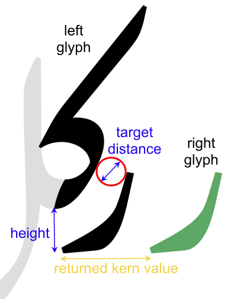
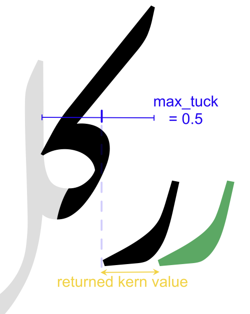

# Kern determiner
## Work out how far apart things should be (very quickly)

`kerndeterminer` is a Rust-based library for determining a kern
value between two glyphs of a font source file.

*(Don't use it for Latin kerning; it won't work. But it works fine for many other scripts)*

Given a font, two glyphs, and a target distance (and a few other parameters),
`kerndeterminer` will return the kern value which places the contours of the
two glyphs the given distance apart at their closest point. The graphic
below explains the main parameters and the effect of `kerndeterminer`:



## How to use

First, create a `KernDeterminer` object. This loads the font, since you'll
probably be making quite a few calls to `determine_kern` and won't want to
load the font each time:

```python
from kerndeterminer import KernDeterminer

kerner = KernDeterminer("MyFont.glyphs")
```

The font source can be any source loadable by the Rust version of Babelfont
(currently Glyphs version 3 files, UFO, and Designspace files).

Next, call the `determine_kern` method on that object:

```python
kern = kerner.determine_kern(
    "JIMi10",  # Left glyph
    "REu1",    # Right glyph
    "Regular", # Master name
    120,       # Target distance
    200,       # Height
    0.8,       # Max tuck
)
```

This will return the optimal kerning value for that pair at the given
parameters. Note:

* The `height` parameter is used to translate the left glyph vertically befor kerning. This is used in Arabic fonts with cursive attachment.
* The `max_tuck` parameter is a ratio of the left glyph's width which forms an upper limit on the kerning value. For example, if `max_tuck` is 0.5, the leftmost point on the right glyph can only be placed so that it is 50% of the way underneath the left glyph:




